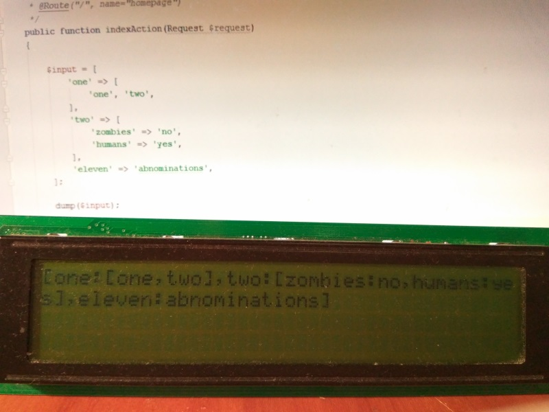

#Proxy LCD Bundle

Symfony3 handler for Proxy LCD project. 
Hooks to dump() and send content to Proxy LCD.
Works nicely in docker. 

Displays only strings so arrays(one- or multi-dimensional) are transformed to string, object are transformed to id and name. 

Read more @ [https://koscis.wordpress.com/tag/proxy-lcd/](https://koscis.wordpress.com/tag/proxy-lcd/)

Parts of this project:

[NodeHD44780](https://github.com/bkosciow/esp_remote_lcd) - remote lcd

[Proxy LCD](https://github.com/bkosciow/proxy_lcd) desktop app

##Installation

    "require-dev": {
        "kosci/proxy-lcd-bundle": "dev-master"
    }    
    
AppKenel:
    
    new Kosci\Bundle\ProxyLCDBundle\KosciProxyLCDBundle(),
        
##Default configuration

    kosci_proxy_lcd:
      proxy_ip: localhost
      proxy_port: 5054
      clear_on_request: false
      dump:
        enabled: false
        mode: stream
      
Without IP bundle is disabled. Only **stream** mode available for now.
For docker env set host IP.

Minimal configuration:

    kosci_proxy_lcd:
      proxy_ip: 192.168.1.102
      dump:
        enabled: true
      
When *clear_on_request: false* content is appended to display. 
With *true* on kernel.request display is cleared and cursor set to (0,0).

        
##Sample outpt
        
    ['one', 'two', 'eleven'] => [one,two,eleven]
       
    [
       'one' => 'zombie',
       'two' => 'zombies',
       'eleven' => 'abnominations'
    ] => [one:zombie,two:zombies,eleven:abnominations]
    
    [
        'one' => [
            'one', 'two'
        ],
        'two' => [
            'zombies' => 'no',
            'humans' => 'yes',
        ],
        'eleven' => 'abnominations'
    ] => [one:[one,two],two:[zombies:no,humans:yes],eleven:abnominations]
    
    $input = new ItemWithName(12) => {ItemWithName:12:name}